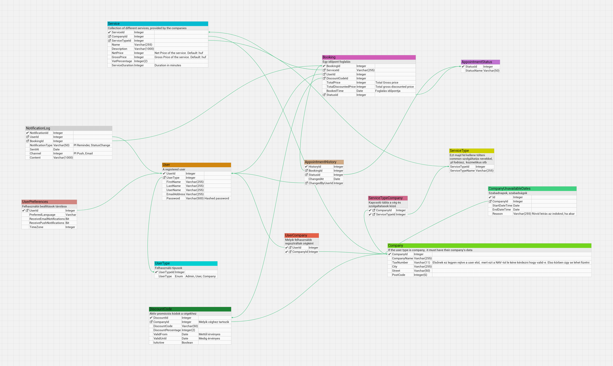

# Appointment App – Frontend

Ez a projekt a `Booking Appointment` rendszer frontend része. A célja egy egyszerű, letisztult időpontfoglaló felület biztosítása a végfelhasználók számára.

A backend forráskódja itt található: [booking-appointment-backend](https://github.com/lkecskes/BookingAppointmentAPI)

# Appointment Booking System

Egy hobbiprojektként indult, skálázható időpontfoglaló rendszer. Célja, hogy felhasználók és cégek egyszerűen tudjanak szolgáltatásokat kezelni és időpontokat foglalni. A rendszer többféle szerepkört (admin, cég, felhasználó) és bővíthető jogosultságkezelést is támogat.

## Fő funkciók

- Felhasználói regisztráció, bejelentkezés (később Google Login)
- Cégek és szolgáltatások kezelése (Admin & Company)
- Időpontfoglalás, kedvezménykódok használata
- Admin és cégoldali foglaláskezelés
- Státuszkövetés & foglalási előzmények
- Naplózás, hozzáférés-kezelés (tervezett)

## Technológiák

- **Backend**: .NET Core / ASP.NET Web API
- **Adatbázis**: MS SQL Server
- **Autentikáció**: JWT token (tervben: OAuth2 / Google Login)
- **Egyéb**: Entity Framework Core, RESTful API-k, Clean Architecture

## Adatbázismodell

> Adatbázis create -> [`/sql/SqlCreate.sql`](./sql/SqlCreate.sql)  
> Fontosabb táblák: `User`, `Company`, `Service`, `Booking`, `AppointmentStatus`, `AppointmentHistory`

## Jövőbeli fejlesztések

- Google Login (OAuth2)
- Foglalási naptár nézet
- Email/SMS értesítések
- Admin dashboard (statisztikák)
- Multilang & reszponzív UI

## ER Diagram

## Készítette

[**@lkecskes**](https://github.com/lkecskes)
